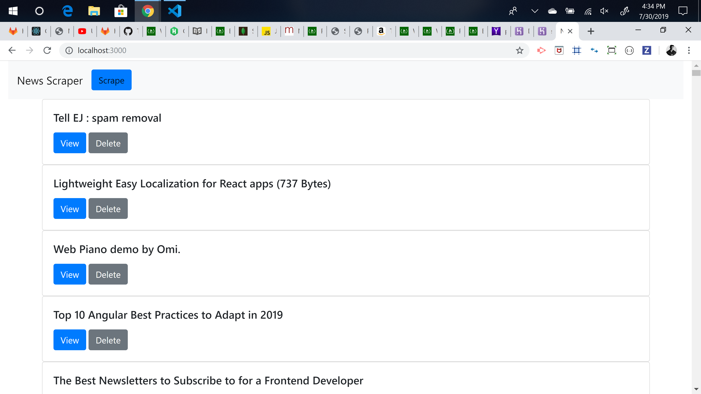
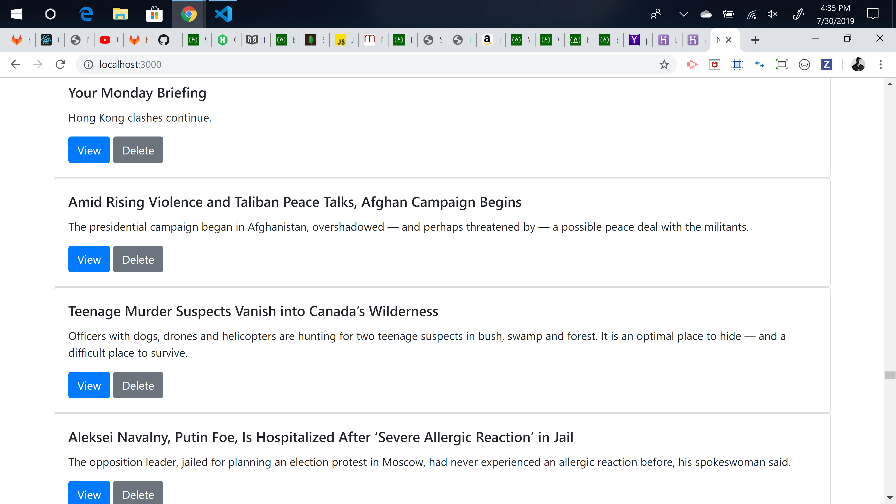
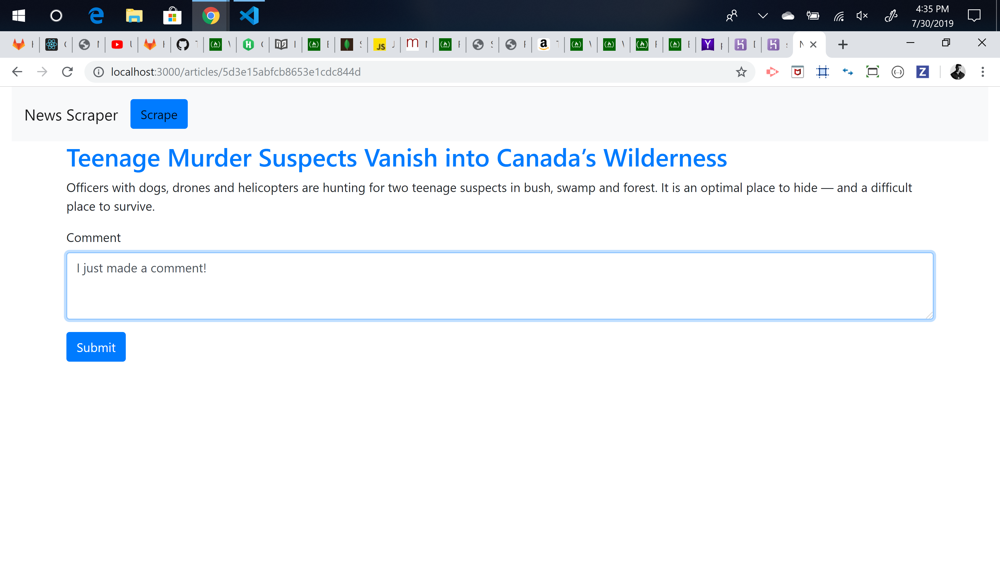
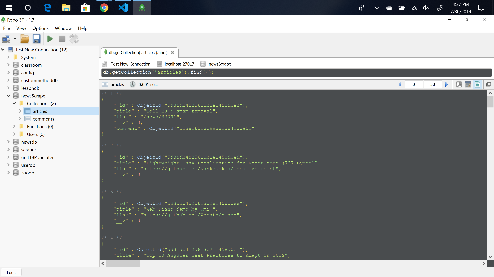

# newsScrape
Homework week-18

The newsScrape app is a full-stack site that scrapes the NY Times website for articles. It displays the latest news as a headline, link and summary section. The user can view and leave comments. 

Heroku deployed app link: https://shrouded-citadel-24439.herokuapp.com/

Issues: 
1.) Heroku link not working. Recieving 'Application Error' 
2.) Delete POST request not completed. 
3.) Originally set up the app to scrape echo.js -- database returns saved articles from those original scrapes. Current NY Times scraped articles appear at the bottom of the page. Changed to NY Times scrape based on in-class assignment was easier to understand in the context of MVC. 

Main page displays.

Scraped articles with article summary displays. 

Comment field takes input. 

MongoDB shows saved articles. 

Tech Used: 

    1. Node.js 
    2. Express.js 
    3. Express-Handlebars 
    4. Mongoose / MongoDB 
    5. Cheerio 
    6. Axios 
    7. Heroku

Built With: 

    VS Code 

Authors: 

    Ryan Fogle 
